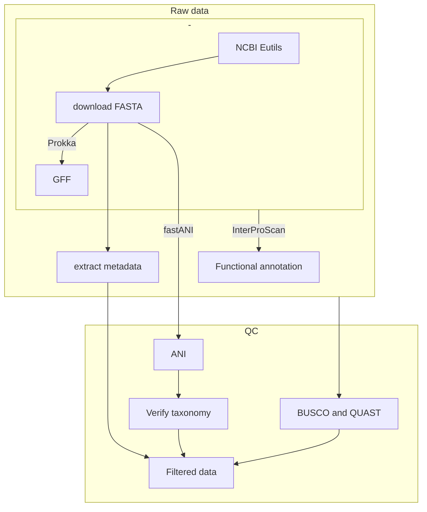
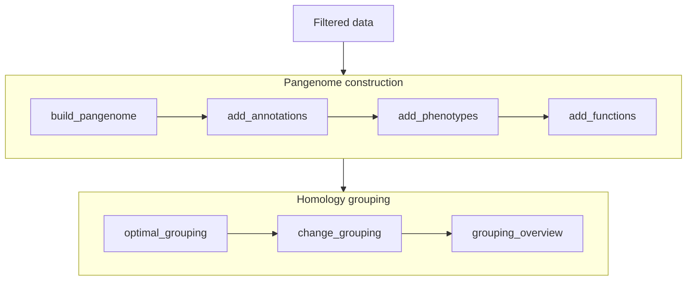
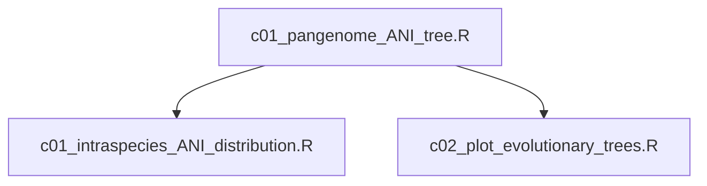

# Pectobacterium pangenome analysis

### IMP NCBI link
https://ftp.ncbi.nlm.nih.gov/genomes/ASSEMBLY_REPORTS/

summarize ANI assembly report: visualize


### Other notes

```bash
## generate heap dump
jmap -dump:live,format=b,file=heap_dump.bin 27422

## dump garbage collection logs
java -XX:+PrintGCTimeStamps -XX:+PrintGCDateStamps -XX:+PrintGCDetails -Xloggc:<filename>

```

## Workflow

### Preprocessing



### Pangenome construction



### Analysis


