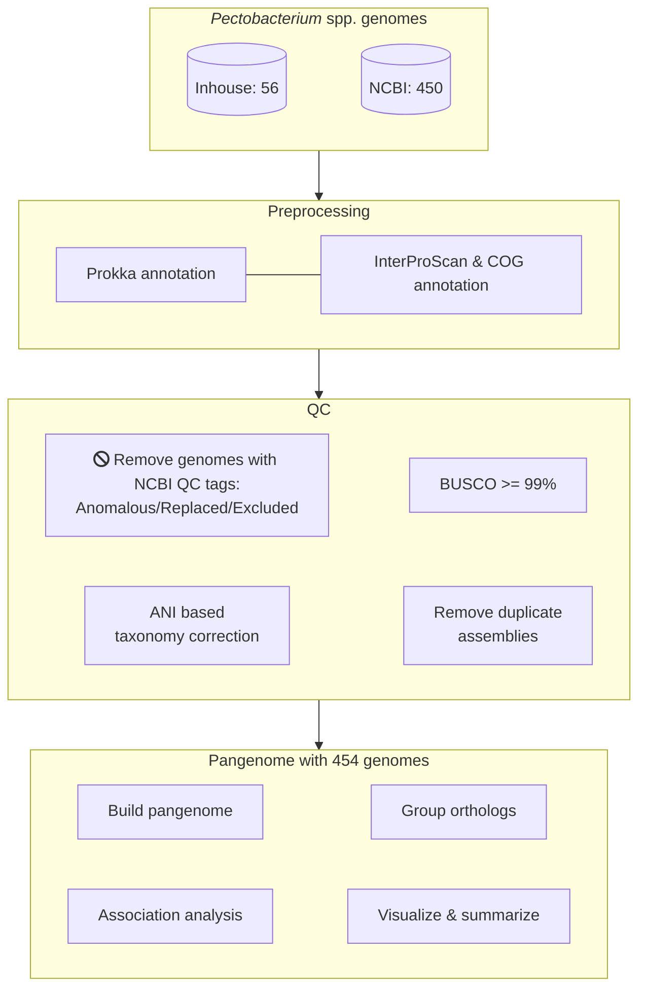
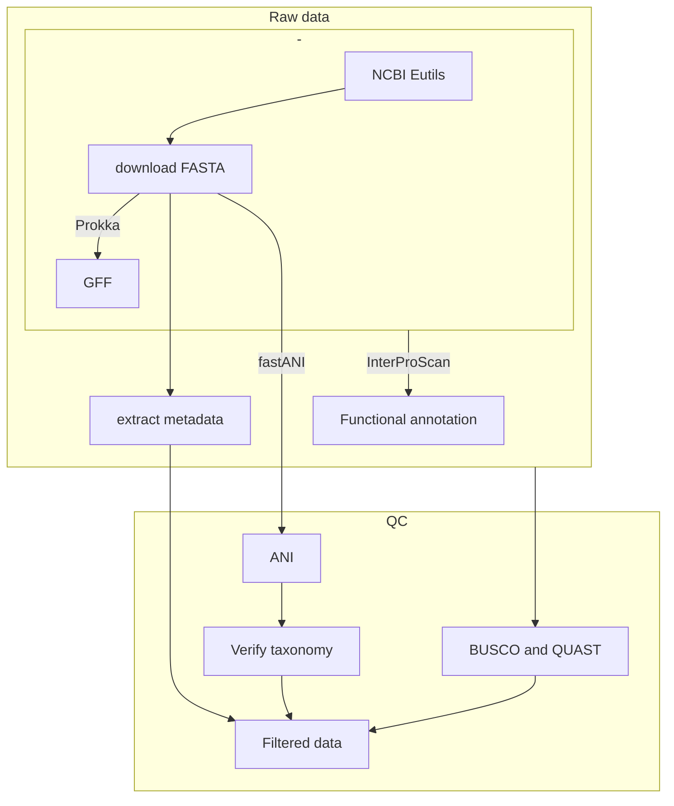
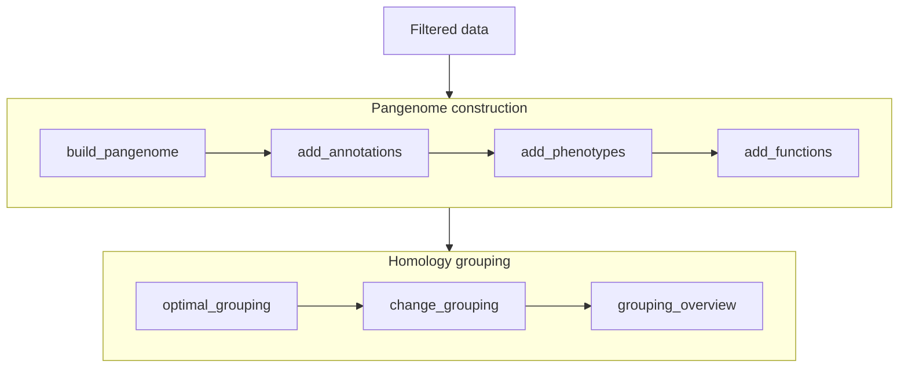

    

        
        
        
        
    

    

        
        
        
    

---

# Pectobacterium pangenome analysis

Please refer to https://lakhanp1.github.io/Pectobacterium_pangenome for data
preprocessing, pangenome construction and prophage analysis workflow documents.

## Project workflow

## [Preprocessing](https://lakhanp1.github.io/Pectobacterium_pangenome/scripts/notebooks/preprocessing.html)

## [Pangenome construction](https://lakhanp1.github.io/Pectobacterium_pangenome/scripts/notebooks/pangenome_construction.html)

## [Prophage analysis](https://lakhanp1.github.io/Pectobacterium_pangenome/scripts/notebooks/prophage_analysis.html)

Tracing prophages in *Pectobacterium* genus pangenome to study their dynamics and contribution to the pangenome growth.