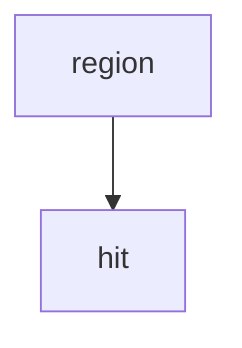

# Clade specific homology groups analysis

## Setup

```bash
#!/usr/bin/env bash

shopt -s expand_aliases
source ~/.bash_aliases

# set -e
# set -u
set -o pipefail

# source scripts/utils/setup_analysis.sh 'pectobacterium.v2'
source scripts/utils/setup_analysis.sh $@

if [ -z ${pan_db+x} ];
then
    echo "\$pan_db is unset"
    error_exit 1
fi

source $TOOLS_PATH/miniconda3/etc/profile.d/conda.sh
conda activate pantools_master
export PANTOOLS="$PANTOOLS_4_1"
######################################################################
```

## Analysis

### Phenotype association

A config file of following format will be parsed by the 
`scripts/c_analysis/phylo.make_clade_cmp_conf.R` to generate a TSV file which
can be used to run `pantools gene_classification` module.

Input:

| tree     | name | compareType | compare   | background | bgExcludeNode | bgExcludeTip |
|----------|------|-------------|-----------|------------|---------------|--------------|
| #kmer_nj | test | node        | n259,n269 | n279,n285  | n291          |           31 |

```bash
## prepare clade comparison config and phenotype file
conda activate r_4.2
Rscript scripts/c_analysis/phylo.make_clade_cmp_conf.R
```

Output:

| name                | phenotypeArg                                                                                                                             | compare | against                                                                                | include                                                                                        |
|---------------------|------------------------------------------------------------------------------------------------------------------------------------------|---------|----------------------------------------------------------------------------------------|------------------------------------------------------------------------------------------------|
| polaris_outlier_cmp | --phenotype=polaris_outlier_cmp --include=160,446,41,44,151,252,338,454,349,79,254,300,46,312,103,105,339,122,251,121,253,255,40,443,275 | 160,446 | 41,44,151,252,338,454,349,79,254,300,46,312,103,105,339,122,251,121,253,255,40,443,275 | 160,446,41,44,151,252,338,454,349,79,254,300,46,312,103,105,339,122,251,121,253,255,40,443,275 |

```bash
conda activate pantools_master

## add the updated phenotypes for association analysis
process_start add_phenotypes
$PANTOOLS remove_phenotype ${pan_db}
$PANTOOLS add_phenotypes ${pan_db} $PANGENOME_DIR/genomes_metadata.csv
$PANTOOLS add_phenotypes ${pan_db} $PANGENOME_DIR/analysis_configs/clade_association_phenotypes.csv
error_exit $?


[ -d ${pan_db}/gene_classification ] && rm -r ${pan_db}/gene_classification
mkdir ${pan_db}/gene_classification.pheno

## Gene classification for each phenotype
phenotypes=(`awk -F "\t" '{ if (NR!=1) {print $1} }' $PANGENOME_DIR/analysis_configs/clade_association_config.tab`)
for phn in ${phenotypes[@]}
do
    process_start "gene_classification for phenotype $phn"
    pheno_arg=`grep "^${phn}\b" $PANGENOME_DIR/analysis_configs/pheno_association_config.tab | cut -f2`
    $PANTOOLS gene_classification ${pheno_arg} ${pan_db}
    error_exit $?

    ## move results to a folder
    pheno_dir=${pan_db}/gene_classification.pheno/${phn}
    [ -d ${pheno_dir} ] && rm -r ${pheno_dir}
    mkdir ${pheno_dir}
    mv ${pan_db}/gene_classification/{phenotype_*,gene_classification_phenotype_overview.txt} ${pheno_dir}/
done

rm -r ${pan_db}/gene_classification
```

```bash
conda activate r_4.2
Rscript scripts/c_analysis/pheno_association_process.R
Rscript scripts/c_analysis/phenotype_association_summary.R
######################################################################
```

### Extract specific information from pangenome

```bash
## Extract specific information from pangenome
##************
# Replace the analysis/04_pangenome_pecto_v2/pheno_association/phenotype_specific_groups.txt
# file dependency by directly accessing pheno_association_config.tab file and parsing
##************

# gene_classification.pheno/${phn}/phenotype_association.csv file
conda activate omics_py37
while IFS=$'\t' read -r phn groups ; do
    # printf "%b\n" "column1<${phn}>"
    # printf "%b\n" "column2<${groups}>"
    process_start "extracting mRNA sequence for homology group specific to phenotype: ${phn}"
    printf "Homology groups: ${groups}\n"

    genome=`grep "^${phn}\b" $PANGENOME_DIR/analysis_configs/pheno_association_config.tab | cut -f3 | sed 's/,.*//'`
    pheno_dir="analysis/04_pangenome_pecto_v2/pheno_association/${phn}"
    [ ! -d ${pheno_dir} ] && mkdir -p ${pheno_dir}

    file_info="${pheno_dir}/${phn}.pheno_specific.seq_info.txt"
    file_info_g1="${pheno_dir}/${phn}.pheno_specific.${genome}g.seq_info.txt"
    file_ffn="${pheno_dir}/${phn}.pheno_specific.${genome}g.ffn"
    file_faa="${pheno_dir}/${phn}.pheno_specific.${genome}g.fna"

    printf "homology_group_id\tGenome\tmRNA_name\tmRNA_identifier\tnode_identifier\tgenome_id\tchr\tstart\tend\tstrand\n"  > ${file_info}
    printf "homology_group_id\tGenome\tmRNA_name\tmRNA_identifier\tnode_identifier\tgenome_id\tchr\tstart\tend\tstrand\n"  > ${file_info_g1}
    printf "" > ${file_ffn}
    printf "" > ${file_faa}

    ## read groups into array
    IFS=',' read -ra hg_array <<< "${groups}"
    for hg in "${hg_array[@]}"
    do
        # printf "${hg} "
        seq_info=`grep "^${genome}" ${hg_aln_dir}/${hg}/input/sequences.info`
        mrna_id=`echo ${seq_info} | cut -d"," -f3`
        protein_id=`echo ${mrna_id} | sed -r "s/${genome}_[0-9]+_//"`
        samtools faidx ${hg_aln_dir}/${hg}/input/nuc.fasta

        printf "${hg}, ${seq_info}\n" | sed -r 's/(, | )/\t/g' >> ${file_info_g1}

        cat ${hg_aln_dir}/${hg}/input/sequences.info |
        sed -n "1,/^#genome/! s/^\(.\)/${hg}, \1/p" |
        sed -r 's/(, | )/\t/g' >> ${file_info}

        samtools faidx ${hg_aln_dir}/${hg}/input/nuc.fasta ${mrna_id} >> ${file_ffn}
        samtools faidx ${pan_db}/proteins/proteins_${genome}.fasta ${protein_id} >> ${file_faa}
    done
done < <(grep '^assay_FN\b' analysis/04_pangenome_pecto_v2/pheno_association/phenotype_specific_groups.txt)

######################################################################

```

### BLAST the assay specific sequence against pangenome

Run blastn on phenotype specific sequences against pangenome to verify that the homology group based specificity is not because of lack of annotation

```bash
conda activate omics_py37

# BLAST the assay specific sequence against pangenome
process_start "blastn clade specific sequences against pangenome"

blastn -db $PANGENOME_DIR/blastdb/genomes_combined.fa \
-query analysis/04_pangenome_pecto_v2/pheno_association/assay_FN/assay_FN.pheno_specific.400g.ffn \
-num_threads 12 -max_target_seqs 5000 \
-outfmt "6 qseqid qstart qend qlen sseqid sstart send sstrand slen pident length mismatch qcovs qcovus gapopen evalue bitscore" \
-out analysis/04_pangenome_pecto_v2/pheno_association/assay_FN/pheno_specific.pangenome.blastn.out

error_exit $?

# BLAST the assay specific sequence against pangenome
process_start "blastn clade specific sequences against nt database"

blastn -db /mnt/LTR_userdata/reference/blast_latest/extracted_latest.nobackup/nt \
-query analysis/04_pangenome_pecto_v2/pheno_association/assay_FN/assay_FN.pheno_specific.400g.ffn \
-num_threads 12 -max_target_seqs 5000 -html \
-outfmt "6 qseqid qstart qend qlen sseqid sstart send sstrand slen staxid ssciname pident length mismatch qcovs qcovus gapopen evalue bitscore" \
-out analysis/04_pangenome_pecto_v2/pheno_association/assay_FN/pheno_specific.400g.nt.blastn.out

error_exit $?
######################################################################
```

```bash
## process pangenome blast results and visualize 
Rscript scripts/c_analysis/pheno_association.blastn_viz.R
```

## Genome to align



## Extract HGs for a specific genome

Use R script `scripts/other/genome_HGs.R` and change the query as shown below.

Genome g_195: A TP *P. brasiliense* genome that has single contig genome assembly.

```r
genomeOfInterest <- "g_195"

treeMethod <- "kmer_upgma" # ani_upgma, kmer_upgma
nodeInclude <- "n11"
nodeExclude <- "n23"
```

Genome g_182: *P. brasiliense* lacking CTV cluster

```r
genomeOfInterest <- "g_182"

treeMethod <- "kmer_upgma" # ani_upgma, kmer_upgma
nodeInclude <- "n11"
nodeExclude <- "n145"
```

## Build HGs comparison table of multiple genomes

Use R script `scripts/other/genomes_HG_pav.R` and change the query as shown below.

Compare FN-Pbr, TP-Pbr with other non-BL-causing Pbr from the Netherlands

```r
genomeOfInterest <- c("g_187", "g_399", "g_179", "g_191")
coreClade <- "n11"
nodeExclude <- "n22"
```


Compare FN-Pbr, TP-Pbr and CTV lacking Pbr

```r
genomeOfInterest <- c("g_187", "g_399", "g_182")
coreClade <- "n11"
nodeExclude <- NA
```
